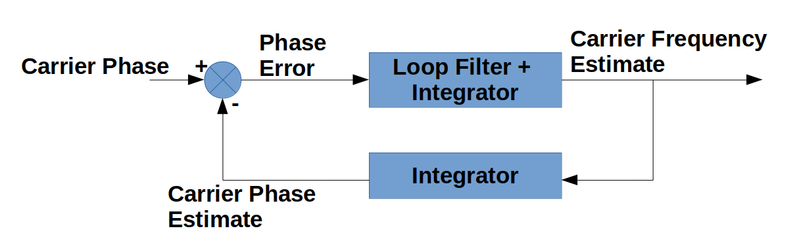

# Tracking

The tracking algorithm is currently specific to the L1 C/A signal and has three possible states: "Waiting for Initial Lock Status", "Tracking", and "Lost Lock".  Within the tracking algorithm, there are two key systems whose performance and outputs dictate transitions between states and the output that goes to telemetry decoding.  One of these systems tracks the carrier and one tracks the CDMA code.  These two systems are similar and the best way to explain them is probably to explain the carrier tracking system first, then explain the small differences in the code tracking system.

## Carrier Tracking

The carrier tracking system uses a form of a phase-locked loop.  We'll use some less-commonly used techniques to design the filter, but it's useful to start by representing the system in a block diagram form that's familiar to many people.

The tracking algorithm maintains its own estimate of the carrier phase and frequency.  It periodically compares the local estimate to the carrier, producing an estimate of the phase error.  In phase locked loops in general (analog and digital), there's a wide range of possibilities for the phase detector but the choice for our purposes will be relatively straightforward.  The output of the phase detector goes into a loop filter.  In analog phase-locked loops, the output of the loop filter directly drives a voltage-controlled oscillator, which produces a frequency proportional to its input.  This means that there needs to be some constant phase error for the loop to stay in a locked state, meaning that if the frequencies are locked, there will be a constant phase shift.  This isn't the case for our system, as will be described below.  In our system, the output of the loop filter is integrated and the output of this integration is the frequency estimate.  This means that there doesn't have to be a constant phase error to keep the loop locked.  This frequency estimate is subsequently integrated to produce the phase estimate, which feeds back to the phase detector.

If the above paragraph doesn't make sense, it's okay to skip it.  It's provided mainly for the benefit of people who are familiar with phase-locked loops in other contexts.  We don't need to know anything about how phase-locked loops are implemented somewhere else.  We can pretend we're the first ones to ever do this.  We simply describe our system mathematically using equations, then solve them.  Before we can solve the problem, we need to describe it.  We'll use the following notation:

|  Symbol                    | Description                  |
|----------------------------|------------------------------|
| \\( \hat{\omega}_n \\)     |  Current frequency estimate  |
| \\( \hat{\omega}_{n-1} \\) |  Previous frequency estimate |
| \\( \hat{\phi}_n \\)       |  Current phase estimate      |
| \\( \hat{\phi}_{n-1} \\)   |  Previous phase estimate     |
| \\( \omega \\)             |  True carrier frequency      |
| \\( \phi_n \\)             |  True current phase          |
| \\( \phi_{n-1} \\)         |  True previous phase         |
| \\( \tilde{\phi}_n \\)     |  Current phase error         |
| \\( \tilde{\phi}_{n-1} \\) |  Previous phase error        |
| \\( \Delta t \\)           |  Time step                   |

We'll treat the true carrier frequency as constant.  We'll start by designing the filter loop, then come back and explain how the phase detector works.

### Carrier Tracking Loop Filter Design

We'll start by just using the notation above to write equations describing the system.  First, we integrate our frequency estimate to get our phase estimate using the following equation.

\\[ \hat \phi_n = \hat \phi_{n-1} + \Delta t \hat \omega_{n-1} \\]

There's a similar equation for the true phase but since the true frequency is constant, we can represent it without the explicit frequency term.

\\[ \phi_n = \phi_{n-1} + \Delta t \omega \\]

\\[ \phi_n = \phi_{n-1} + \Delta t (\frac{\phi_{n-1} - \phi_{n-2}}{\Delta t}) \\]

\\[ \phi_n = \phi_{n-1} + \phi_{n-1} - \phi_{n-2} \\]

\\[ \phi_n = 2 \phi_{n-1} - \phi_{n-2} \\]

Now we need an expression for the filter itself.  It's a first-order (2-tap) finite-impulse response (FIR) filter.  The "finite" refers to the fact that it depends on a finite number of the most recent samples.  The output of the filter is used to increment the frequency estimate.

\\[ \hat \omega_n = \hat \omega_{n-1} + a_1 \tilde \phi_{n-1} + a_0 \tilde \phi_{n-2} \\]

\\[ \hat \omega_n = \hat \omega_{n-1} + a_1 (\phi_{n-1} - \hat \phi_{n-1}) + a_0 (\phi_{n-2} - \hat \phi_{n-2}) \\]

\\[ \hat \omega_n = \hat \omega_{n-1} - a_1 \hat \phi_{n-1} - a_0 \hat \phi_{n-2} + a_1 \phi_{n-1} + a_0 \phi_{n-2} \\]

This is already enough to build a state transition matrix.

\\[ \begin{bmatrix} \hat \omega_n \\\\ \hat \phi_{n} \\\\ \hat \phi_{n-1} \\\\ \phi_{n} \\\\ \phi_{n-1} \end{bmatrix} = 
	\begin{bmatrix}        1 & -a_1 & -a_0 & a_1 & a_0 \\\\ 
	                \Delta t &    1 &    0 &   0 &   0 \\\\
	                       0 &    1 &    0 &   0 &   0 \\\\
	                       0 &    0 &    0 &   2 &  -1 \\\\
	                       0 &    0 &    0 &   1 &   0 \end{bmatrix} 
	\begin{bmatrix} \hat \omega_{n-1} \\\\ \hat \phi_{n-1} \\\\ \hat \phi_{n-2} \\\\ \phi_{n-1} \\\\ \phi_{n-2} \end{bmatrix} \\]

However, for our purposes, it's more convenient to include the phase error in place of the true phase.  The following state transition matrix is equivalent.

\\[ \begin{bmatrix} \hat \omega_n \\\\ \hat \phi_{n} \\\\ \hat \phi_{n-1} \\\\ \tilde \phi_{n} \\\\ \tilde \phi_{n-1} \end{bmatrix} = 
	\begin{bmatrix}        1 &    0 &    0 & a_1 & a_0 \\\\ 
	                \Delta t &    1 &    0 &   0 &   0 \\\\
	                       0 &    1 &    0 &   0 &   0 \\\\
	               -\Delta t &    1 &   -1 &   2 &  -1 \\\\
	                       0 &    0 &    0 &   1 &   0 \end{bmatrix} 
	\begin{bmatrix} \hat \omega_{n-1} \\\\ \hat \phi_{n-1} \\\\ \hat \phi_{n-2} \\\\ \tilde \phi_{n-1} \\\\ \tilde \phi_{n-2} \end{bmatrix} \\]

