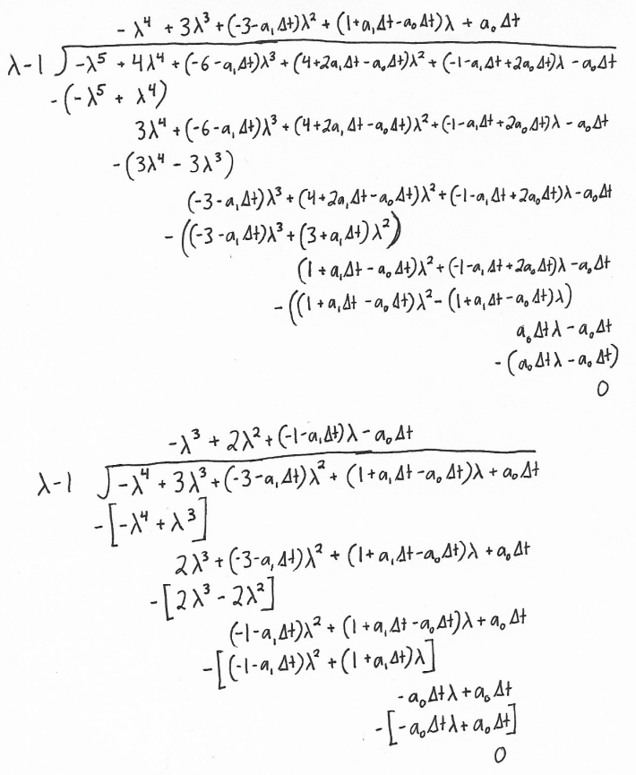
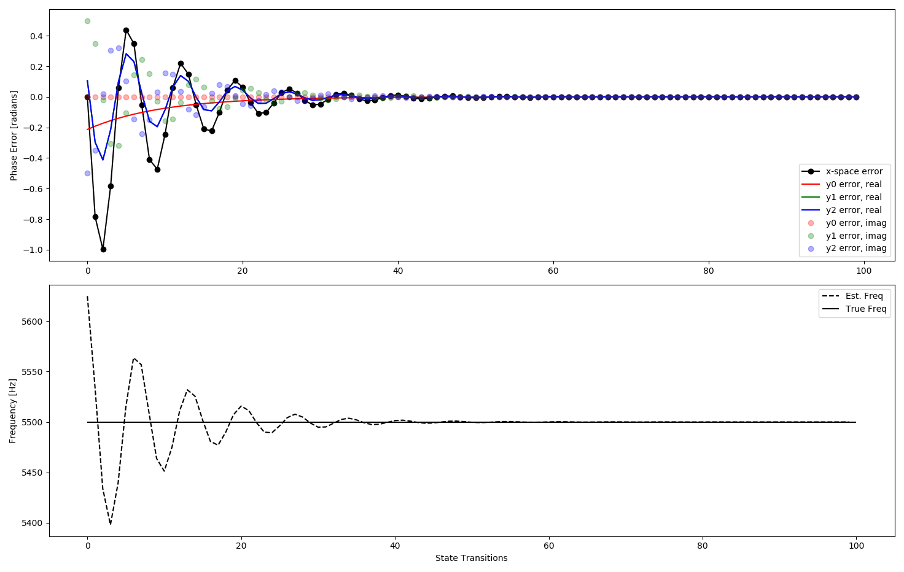

# Tracking

The tracking algorithm is currently specific to the L1 C/A signal and has three possible states: "Waiting for Initial Lock Status", "Tracking", and "Lost Lock".  Within the tracking algorithm, there are two key systems whose performance and outputs dictate transitions between states and the output that goes to telemetry decoding.  One of these systems tracks the carrier and one tracks the CDMA code.  These two systems are similar and the best way to explain them is probably to explain the carrier tracking system first, then explain the small differences in the code tracking system.

## Carrier Tracking

The carrier tracking system uses a form of a phase-locked loop.  We'll use some less-commonly used techniques to design the filter, but it's useful to start by representing the system in a block diagram form that's familiar to many people.


The tracking algorithm maintains its own estimate of the carrier phase and frequency.  It periodically compares the local estimate to the carrier, producing an estimate of the phase error.  In phase locked loops in general (analog and digital), there's a wide range of possibilities for the phase detector but the choice for our purposes will be relatively straightforward.  The output of the phase detector goes into a loop filter.  In analog phase-locked loops, the output of the loop filter directly drives a voltage-controlled oscillator, which produces a frequency proportional to its input.  This means that there needs to be some constant phase error for the loop to stay in a locked state, meaning that if the frequencies are locked, there will be a constant phase shift.  This isn't the case for our system, as will be described below.  In our system, the output of the loop filter is integrated and the output of this integration is the frequency estimate.  This means that there doesn't have to be a constant phase error to keep the loop locked.  This frequency estimate is subsequently integrated to produce the phase estimate, which feeds back to the phase detector.

If the above paragraph doesn't make sense, it's okay to skip it.  It's provided mainly for the benefit of people who are familiar with phase-locked loops in other contexts.  We don't need to know anything about how phase-locked loops are implemented somewhere else.  We can pretend we're the first ones to ever do this.  We simply describe our system mathematically using equations, then solve them.  Before we can solve the problem, we need to describe it.  We'll use the following notation:

|  Symbol                    | Description                  |
|----------------------------|------------------------------|
| \\( \hat{\omega}_n \\)     |  Current frequency estimate  |
| \\( \hat{\omega}_{n-1} \\) |  Previous frequency estimate |
| \\( \hat{\phi}_n \\)       |  Current phase estimate      |
| \\( \hat{\phi}_{n-1} \\)   |  Previous phase estimate     |
| \\( \omega \\)             |  True carrier frequency      |
| \\( \phi_n \\)             |  True current phase          |
| \\( \phi_{n-1} \\)         |  True previous phase         |
| \\( \tilde{\phi}_n \\)     |  Current phase error         |
| \\( \tilde{\phi}_{n-1} \\) |  Previous phase error        |
| \\( \Delta t \\)           |  Time step                   |

We'll treat the true carrier frequency as constant.  We'll start by designing the filter loop, then come back and explain how the phase detector works.

### Carrier Tracking Loop Filter Design

We'll start by just using the notation above to write equations describing the system.  First, we integrate our frequency estimate to get our phase estimate using the following equation.

\\[ \hat \phi_n = \hat \phi_{n-1} + \Delta t \hat \omega_{n-1} \\]

There's a similar equation for the true phase but since the true frequency is constant, we can represent it without the explicit frequency term.

\\[ \phi_n = \phi_{n-1} + \Delta t \omega \\]

\\[ \phi_n = \phi_{n-1} + \Delta t (\frac{\phi_{n-1} - \phi_{n-2}}{\Delta t}) \\]

\\[ \phi_n = \phi_{n-1} + \phi_{n-1} - \phi_{n-2} \\]

\\[ \phi_n = 2 \phi_{n-1} - \phi_{n-2} \\]

Now we need an expression for the filter itself.  It's a first-order (2-tap) finite-impulse response (FIR) filter.  The "finite" refers to the fact that it depends on a finite number of the most recent samples.  The output of the filter is used to increment the frequency estimate.

\\[ \hat \omega_n = \hat \omega_{n-1} + a_1 \tilde \phi_{n-1} + a_0 \tilde \phi_{n-2} \\]

\\[ \hat \omega_n = \hat \omega_{n-1} + a_1 (\phi_{n-1} - \hat \phi_{n-1}) + a_0 (\phi_{n-2} - \hat \phi_{n-2}) \\]

\\[ \hat \omega_n = \hat \omega_{n-1} - a_1 \hat \phi_{n-1} - a_0 \hat \phi_{n-2} + a_1 \phi_{n-1} + a_0 \phi_{n-2} \\]

This is already enough to build a state transition matrix.

\\[ \begin{bmatrix} \hat \omega_n \\\\ \hat \phi_{n} \\\\ \hat \phi_{n-1} \\\\ \phi_{n} \\\\ \phi_{n-1} \end{bmatrix} = 
	\begin{bmatrix}        1 & -a_1 & -a_0 & a_1 & a_0 \\\\ 
	                \Delta t &    1 &    0 &   0 &   0 \\\\
	                       0 &    1 &    0 &   0 &   0 \\\\
	                       0 &    0 &    0 &   2 &  -1 \\\\
	                       0 &    0 &    0 &   1 &   0 \end{bmatrix} 
	\begin{bmatrix} \hat \omega_{n-1} \\\\ \hat \phi_{n-1} \\\\ \hat \phi_{n-2} \\\\ \phi_{n-1} \\\\ \phi_{n-2} \end{bmatrix} \\]

However, for our purposes, it's more convenient to include the phase error in place of the true phase.  The following state transition matrix is equivalent.

\\[ \begin{bmatrix} \hat \omega_n \\\\ \hat \phi_{n} \\\\ \hat \phi_{n-1} \\\\ \tilde \phi_{n} \\\\ \tilde \phi_{n-1} \end{bmatrix} = 
	\begin{bmatrix}        1 &    0 &    0 & a_1 & a_0 \\\\ 
	                \Delta t &    1 &    0 &   0 &   0 \\\\
	                       0 &    1 &    0 &   0 &   0 \\\\
	               -\Delta t &    1 &   -1 &   2 &  -1 \\\\
	                       0 &    0 &    0 &   1 &   0 \end{bmatrix} 
	\begin{bmatrix} \hat \omega_{n-1} \\\\ \hat \phi_{n-1} \\\\ \hat \phi_{n-2} \\\\ \tilde \phi_{n-1} \\\\ \tilde \phi_{n-2} \end{bmatrix} \\]

We can characterize the behavior of this matrix using its eigenvalues and eigenvectors.  The eigenvalues are the roots of the characteristic equation:

\\[ -\lambda^5 + 4\lambda^4 - (6 + a_1 \Delta t)\lambda^3 + (4 + 2 a_1 \Delta t - a_0 \Delta t)\lambda^2 - (1 + a_1 \Delta t - 2 a_0 \Delta t)\lambda - a_0 \Delta t \\]

From the characteristic equation, we can use polynomial long division to determine that this matrix will always have a double eigenvalue at 1.  The long division is shown below in an image (it's hard to represent long division in MathJax).



After factoring out this double root, the remaining polynomial is:

\\[ -\lambda^3 + 2 \lambda^2 - ( 1 + a_1 \Delta t) \lambda - a_0 \Delta t \\]

The double root represents the part of the model that doesn't depend on the filter coefficients.  The remaining third-order polynomial characterizes the parts of the model that do depend on the filter coefficients, the parts we get to control.

For the remaining three roots, there are two possibilities.  We can either have one real root and two complex conjugate roots or we can have three real roots.  These are two different ways of designing the filter.  In either case, we pick the three roots we want, find the coefficients of the third-order polynomial that has these roots, then compare these coefficients to the coefficients in terms of the time step and the two filter coefficients.  

We'll start with the case of one real root and two complex conjugate roots.  We'll find that this filter is characterized by two coefficients, which we'll represent using \\( \alpha_1 \\) and \\( \alpha_2 \\), which should both be less than one.  However, there's a limit to how low these coefficients can be, which we'll see.  We'll call this an alpha-filter.  In addition to these two coefficients, we'll represent the angle of the complex conjugates from the positive real axis using \\( \theta \\).  Therefore, we find the polynomial this way:

\\[ (\lambda - \alpha_1) (\lambda - \alpha_2 e^{i \theta}) (\lambda - \alpha_2 e^{-i \theta}) \\]

\\[ (\lambda - \alpha_1) (\lambda^2 - \lambda \alpha_2 e^{i \theta} - \lambda \alpha_2 e^{-i \theta} + {\alpha_2}^2 e^{i \theta} e^{-i \theta}) \\]

\\[ (\lambda - \alpha_1) (\lambda^2 - \lambda \alpha_2 (e^{i \theta} + e^{-i \theta}) + {\alpha_2}^2) \\]

\\[ (\lambda - \alpha_1) (\lambda^2 - 2 \lambda \alpha_2 \cos \theta + {\alpha_2}^2) \\]

\\[ \lambda^3 - (2 \alpha_2 \cos \theta + \alpha_1) \lambda^2 + ({\alpha_2}^2 + 2 \alpha_1 \alpha_2 \cos \theta) \lambda - \alpha_1 {\alpha_2}^2 \\]

\\[ -\lambda^3 + (2 \alpha_2 \cos \theta + \alpha_1) \lambda^2 - ({\alpha_2}^2 + 2 \alpha_1 \alpha_2 \cos \theta) \lambda + \alpha_1 {\alpha_2}^2 \\]

By comparison with the other form of the polynomial, we get:

\\[ 2 = 2 \alpha_2 \cos \theta + \alpha_1 \\]

\\[ 1 + a_1 \Delta t = {\alpha_2}^2 + 2 \alpha_1 \alpha_2 \cos \theta \\]

\\[ -a_0 \Delta t = \alpha_1 {\alpha_2}^2 \\]

We can pick any values for \\( \alpha_1 \\) and \\( \alpha_2 \\) consisent with a constraint that is found by rearranging the first equation:

\\[ 2 = 2 \alpha_2 \cos \theta + \alpha_1 \\]

\\[ \frac{2 - \alpha_1}{2 \alpha_2} = \cos \theta \\]

\\[ \frac{2 - \alpha_1}{2 \alpha_2} \le 1 \\]

Picking values for these coefficients less than one will guarantee that the components of the state vector in the directions of the eigenvectors associated with these roots will decay in magnitude with each state transition.  Over time, the only components of the state vector that remain will be in the direction of the eigenvectors associated with the real double root.  Since the root is double, there's only one ordinary eigenvector, but there will be a second generalized eigenvector, which we'll find in order to simulate the behavior of the system in the linear space of the generalized eigenvectors.  For a given time step, the coefficients are found using the following equations:

\\[ a_0 = \frac{-\alpha_1 (\alpha_2)^2}{\Delta t} \\]

\\[ a_1 = \frac{(\alpha_2)^2 + 2 \alpha_1 - (\alpha_1)^2 - 1}{\Delta t} \\]

We can't use the ordinary eigenvectors as a basis to represent the state vector because there's a repeated eigenvalue with a repeated eigenvector.  Repeated eigenvectors also mean that the matrix can't be diagonalized.  However, we can complete the basis using generalized eigenvectors and the matrix can be put into Jordan normal form, which is essentially the next best thing to a diagonal matrix for a matrix that can't be diagonalized.  A generalized eigenvector of rank \\(m\\) is defined for a square matrix \\( A \\) so that:

\\[ (A - \lambda_i I)^m \mathbf x_m = 0 \\] 
\\[ (A - \lambda_i I)^{m-1} \mathbf x_m \ne 0 \\]

The special case of a generalized eigenvector of rank 1 is an ordinary eigenvector.  Regardless of the time step and filter coefficients, the double eigenvalue at 1 will always have the same ordinary eigenvector:

\\[ (A - \lambda I) \mathbf x_1 = 0 \\]

\\[ (A - I) \mathbf x_1 = 0 \\]

\\[ \begin{bmatrix}        0 &    0 &    0 & a_1 & a_0 \\\\ 
	                \Delta t &    0 &    0 &   0 &   0 \\\\
	                       0 &    1 &   -1 &   0 &   0 \\\\
	               -\Delta t &    1 &   -1 &   1 &  -1 \\\\
	                       0 &    0 &    0 &   1 &  -1 \end{bmatrix} 
	\begin{bmatrix} 0 \\\\ 1 \\\\ 1 \\\\ 0 \\\\ 0 \end{bmatrix} = 
	\begin{bmatrix} 0 \\\\ 0 \\\\ 0 \\\\ 0 \\\\ 0 \end{bmatrix}\\]

If we can find a vector that satisfies the following equation, it will be a rank 2 generalized eigenvector associated with \\( \lambda=1 \\) for this system.

\\[ (A - I) \mathbf x_2 = \mathbf x_1 \\]

This is because by satisfying this equation, we already know that we meet the second requirement of a generalized eigenvector given above since \\( \mathbf x_1 \ne 0 \\).  We also know that we'll satisfy the first requirement because of the properties of the ordinary eigenvector.

\\[ (A - I) (A - I) \mathbf x_2 = (A - I) \mathbf x_1 = 0 \\]

\\[ (A - I)^2 \mathbf x_2 = 0 \\]

Therefore, we need to find a solution to this linear system:

\\[ \begin{bmatrix}        0 &    0 &    0 & a_1 & a_0 \\\\ 
	                \Delta t &    0 &    0 &   0 &   0 \\\\
	                       0 &    1 &   -1 &   0 &   0 \\\\
	               -\Delta t &    1 &   -1 &   1 &  -1 \\\\
	                       0 &    0 &    0 &   1 &  -1 \end{bmatrix} 
	\begin{bmatrix} x_1 \\\\ x_2 \\\\ x_3 \\\\ x_4 \\\\ x_5 \end{bmatrix} = 
	\begin{bmatrix} 0   \\\\ 1   \\\\ 1   \\\\ 0   \\\\ 0   \end{bmatrix}\\]

\\[ \begin{bmatrix}        0 &    0 &    0 & a_1 & a_0 \\\\ 
	                \Delta t &    0 &    0 &   0 &   0 \\\\
	                       0 &    1 &   -1 &   0 &   0 \\\\
	               -\Delta t &    1 &   -1 &   1 &  -1 \\\\
	                       0 &    0 &    0 &   1 &  -1 \end{bmatrix} 
	\begin{bmatrix} 1 / \Delta t \\\\ 1 \\\\ 0 \\\\ 0 \\\\ 0 \end{bmatrix} = 
	\begin{bmatrix} 0            \\\\ 1 \\\\ 1 \\\\ 0 \\\\ 0 \end{bmatrix}\\]

This vector completes our linear basis and we can now use it to simulate the system.

```python
import numpy as np

dt = 1.0e-3

omega       = 5500 * 2 * np.pi
omega_hat_1 = 5625 * 2 * np.pi 	# Start with a 125 [Hz] error

design_alpha1 = 0.9
design_alpha2 = 0.9

# Units are [1/sec]; these are multiplied by an error with units [radians] to get a frequency [radians/sec]
# a0 = coefficient applied to the older error, err_n      
# a1 = coefficient applied to the newer error, err_n+1
a0 = -(design_alpha1 * pow(design_alpha2, 2)) / dt    
a1 =  (pow(design_alpha2, 2) + 2*design_alpha1 - pow(design_alpha1, 2) - 1) / dt

phi_hat_1 =  0.0
phi_hat_0 = -omega_hat_1*dt
phi_1     =  0.0
phi_0     = -omega*dt
err_1     =  0.0
err_0     =  phi_0 - phi_hat_0

A = np.matrix([[  1,   0,   0,  a1, a0],    # omega_hat_2
               [ dt,   1,   0,  0,  0 ],    # phi_hat_2
               [  0,   1,   0,  0,  0 ],    # phi_hat_1
               [-dt,   1,  -1,  2, -1 ],    # e_2
               [  0,   0,   0,  1,  0 ]])   # e_1

x = np.matrix([omega_hat_1, phi_hat_1, phi_hat_0, err_1, err_0]).transpose()

# Generalized eigenvector for the double root
gen_eig_vec_2 = np.matrix([1.0/dt, 1.0, 0.0, 0.0, 0.0]).transpose()
gen_eig_vec_2 = gen_eig_vec_2 / np.linalg.norm(gen_eig_vec_2)

# Insert the rank-2 generalized eigenvector in order to get a generalized modal matrix
lam, M = np.linalg.eig(A)
idx = 4    # 4 happens to the be right index in this case, but check it in other cases
for i in range(5):
    M[i,idx] = gen_eig_vec_2[i,0]

# Get the state transition matrix in Jordan normal form
J = np.linalg.inv(M) * A * M

# Get the initial state vector in the new basis
y = np.linalg.inv(M) * x

history = []
for _ in range(100):
    history.append({'x':np.copy(x), 'y':np.copy(y)})
    x = A*x  	# State transition in normal state-space
    y = J*y  	# State transition in eigen-space
    
    # Nonlinearity enforced on error
    x[3,0] = np.arcsin(np.sin(x[3,0]))
    x[4,0] = np.arcsin(np.sin(x[4,0]))

# Plotting
import matplotlib.pyplot as plt

plt.subplot(211)
plt.plot([h['x'][3,0] for h in history], 'ko-', label='x-space error')
plt.plot([(M[3,0]*h['y'][0,0]).real for h in history], 'r-', label='y0 error, real')
plt.plot([(M[3,1]*h['y'][1,0]).real for h in history], 'g-', label='y1 error, real')
plt.plot([(M[3,2]*h['y'][2,0]).real for h in history], 'b-', label='y2 error, real')
plt.plot([(M[3,0]*h['y'][0,0]).imag for h in history], 'ro', alpha=0.3, label='y0 error, imag')
plt.plot([(M[3,1]*h['y'][1,0]).imag for h in history], 'go', alpha=0.3, label='y1 error, imag')
plt.plot([(M[3,2]*h['y'][2,0]).imag for h in history], 'bo', alpha=0.3, label='y2 error, imag')
plt.legend()
plt.ylabel('Phase Error [radians]')

plt.subplot(212)
plt.plot([h['x'][0,0]/(2*np.pi) for h in history], 'k--', label='Est. Freq')
plt.hlines(omega/(2*np.pi), 0, len(history), 'k', label='True Freq')
plt.xlabel('State Transitions')
plt.ylabel('Frequency [Hz]')
plt.legend()

```



The simulation shows that the error converges to zero as expected.  The top plot shows the normal state-space phase error in black.  The colored lines show the components of this error represented in the eigenvector basis.  Of the five generalized eigenvectors, three contribute to phase error and they are represented using red, green, and blue.  Since these are complex values, the solid lines represent the real components and the dots represent the imaginary components.  The red line represents the purely exponentially-decaying portion of the error, corresponding to the single real root of the characteristic polynomial (apart from the double root at 1).  The blue and green lines represent the components corresponding to the two complex conjugate eigenvalues.  Their real components are directly on top of each other, but you can tell them apart by their imaginary components.

You'll also notice in the Python code that there's a non-linearity enforced on the phase error.  This is a general feature of phase-locked loops and one of the main challenges in designing them.  As soon as the error exceeds 180 degrees, it instantly jumps to -180 degrees and starts to "pull the wrong way".  Within the linear region, we can find well-defined solutions to characterize the system.  Outside this range, there's no good analytical method to predict the behavior (that I'm aware of) and the behavior can only be approximately predicted using simulations and/or experiment.  Ideally, you just design the system to stay in the linear region as much as possible.  For example, when we set up the search in the acquisition algorithm, we space the frequencies close enough together to keep the initial frequency error within the range where the tracking algorithm has a good chance of staying in this linear region.

We can also design the filter with three real roots in the characteristic polynomial (in addition to the double root at 1).  We'll call this one a beta-filter and design it in a similar way to the alpha-filter.

\\[  (\lambda - \beta_1)(\lambda - \beta_2)(\lambda - \beta_3) \\]

\\[  (\lambda^2 - \beta_1 \lambda - \beta_2 \lambda + \beta_1 \beta_2)(\lambda - \beta_3) \\]

\\[  \lambda^3 - (\beta_1 + \beta_2 + \beta_3)\lambda^2 + (\beta_1 \beta_2 + \beta_2 \beta_3 + \beta_3 \beta_1)\lambda - \beta_1 \beta_2 \beta_3 \\]

\\[ -\lambda^3 + (\beta_1 + \beta_2 + \beta_3)\lambda^2 - (\beta_1 \beta_2 + \beta_2 \beta_3 + \beta_3 \beta_1)\lambda + \beta_1 \beta_2 \beta_3 \\]

Now by comparison with the other form of the polynomial, we get:

\\[ 2 = \beta_1 + \beta_2 + \beta_3 \\]

\\[ 1 + a_1 \Delta t = \beta_1 \beta_2 + \beta_2 \beta_3 + \beta_3 \beta_1 \\]

\\[ -a_0 \Delta t =  \beta_1 \beta_2 \beta_3 \\]

